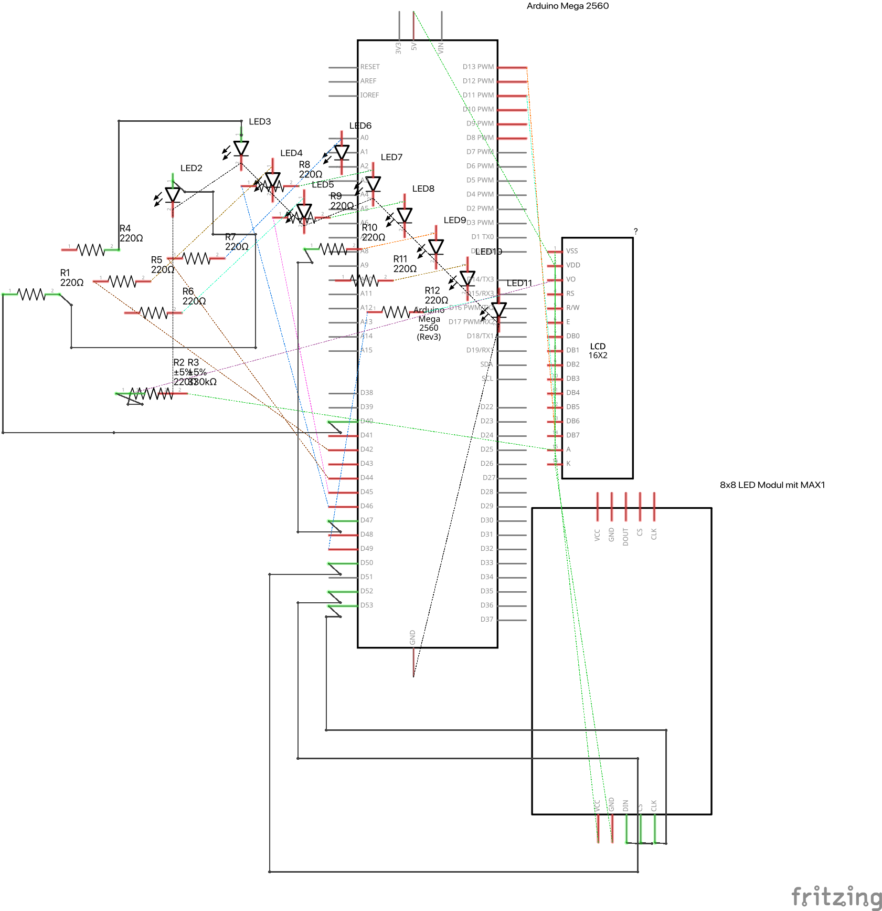
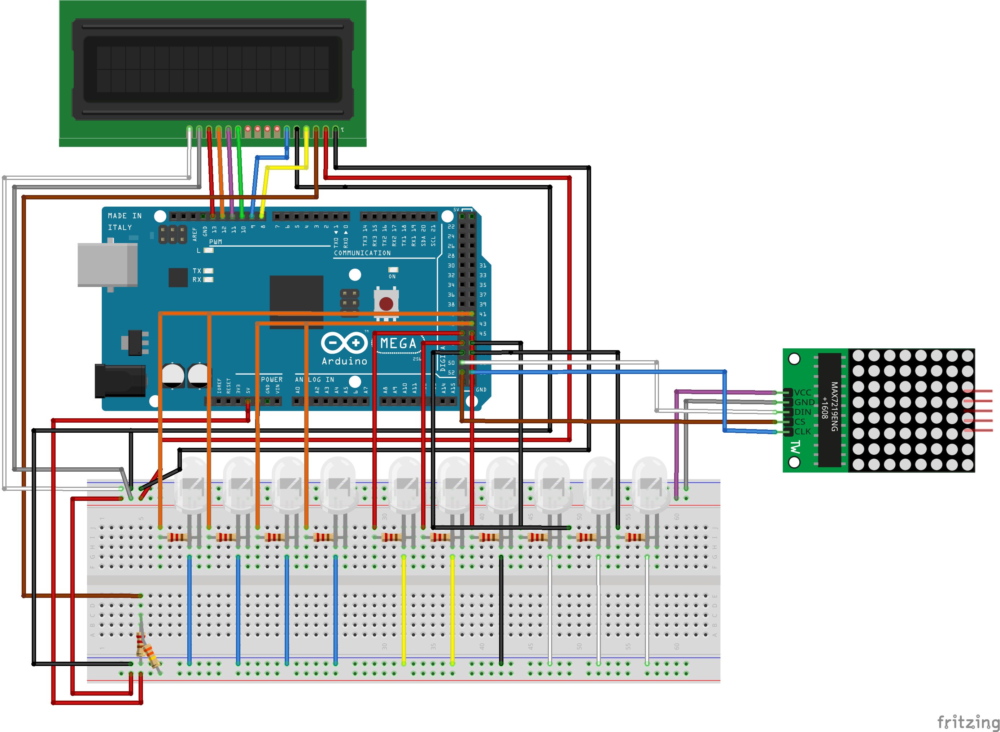

# Astros Game Viewer

A physical Houston Astros scoreboard built on an Arduino Mega. A Python script polls the MLB Stats API every 15 seconds and sends live game data over serial — the Arduino drives an LCD, 10 LEDs, and an 8x8 LED matrix to display the current score, inning, count, and baserunner state.

## Hardware

| Component | Purpose |
|---|---|
| Arduino Mega | Main controller |
| 16x2 LCD (pins 8–13) | Score + inning/outs display |
| 10 LEDs (pins 40–49) | Balls (4), Strikes (3), Outs (3) |
| MAX7219 8x8 LED Matrix (pins 50, 52, 53) | Inning counter + baserunner diamond |

## Schematic





## Software

**`astros_live.py`** — fetches today's Astros game from the MLB Stats API and sends a JSON packet over serial once every 15 seconds.

**`astros-gameviewer.ino`** — reads incoming JSON, updates all displays.

**`src/display.cpp`** — LCD driver (`LiquidCrystal`)

**`src/matrix.cpp`** — MAX7219 matrix driver (`MD_MAX72xx`), renders a top-down diamond with baserunner indicators and a dot-column inning counter

## Setup

### Python

```bash
pip install requests pyserial
python astros_live.py -p /dev/ttyUSB0   # adjust port as needed
```

### Arduino

1. Install libraries via Arduino Library Manager: `ArduinoJson`, `MD_MAX72XX`
2. Open `astros-gameviewer.ino` and upload to an Arduino Mega
3. Run the Python script — the board will begin updating on the next game found for today

## Dependencies

- [ArduinoJson](https://arduinojson.org/)
- [MD_MAX72XX](https://github.com/MajicDesigns/MD_MAX72XX)
- Python: `requests`, `pyserial`
- MLB Stats API (public, no key required)
